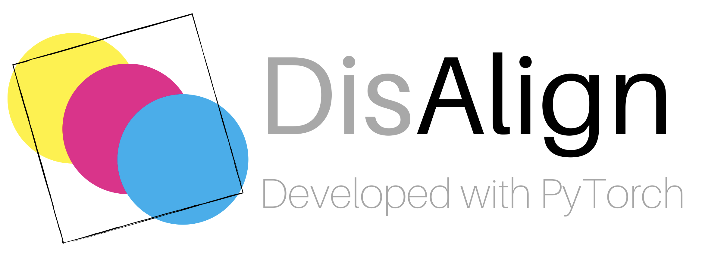

# Distribution Alignment

<!-- <div align=center><div align=mi> -->


Implementation of "Distribution Alignment: A Unified Framework for Long-tail Visual Recognition"(CVPR 2021)

[[Paper]](https://arxiv.org/abs/2103.16370)[[Code]](https://github.com/Megvii-BaseDetection/DisAlign)

We implement the classification, object detection and instance segmentation tasks based on our [cvpods](https://github.com/Megvii-BaseDetection/cvpods). The users should **install cvpods first** and run the experiments in this repo.


## 1. Image Classification
We support the the following three datasets:
- ImageNet-LT Dataset
- iNaturalist-2018 Dataset
- Place-LT Dataset

We refer the user to [CLS_README](classification/README) for more details.

## 2. Object Detection/Instance Segmentation
We support the two versions of the LVIS dataset:
- LVIS v0.5
- LVIS v1.0

**Highlight**
1. To speedup the evaluation on LVIS dataset, we provide the C++ optimized evaluation api by modifying the [coco_eval(C++)]() in `cvpods`.
2. We provide support for the metric of `AP_fixed` and `AP_pool` proposed in [large-vocab-devil](https://github.com/achalddave/large-vocab-devil)
3. We will support more recent works on long-tail detection in this project(e.g. EQLv2, CenterNet2, etc.) in the future.

We refer the user to [DET_README](segmentation/README) for more details.


## 3. Semantic Segmentation

We adopt the mmsegmentation as the codebase for runing all experiments of DisAlign.
Currently, the user should use [DisAlign_Seg](TODO) for the semantic segmentation experiments.
We will add the support for these experiments in [cvpods](https://github.com/Megvii-BaseDetection/cvpods) in the future.

# Acknowledgement

Thanks for the following projects:
- [cvpods](https://github.com/Megvii-BaseDetection/cvpods)
- [Detectron2](https://github.com/facebookresearch/detectron2)
- [mmsegmentation](https://github.com/open-mmlab/mmsegmentation)
- [classifier-balancing](https://github.com/facebookresearch/classifier-balancing)


# Citing DisAlign
If you are using the DisAlign in your research or with to refer to the baseline results publised in this repo, please use the following BibTex entry.

```latex
@inproceedings{liu2020ppnet,
  title={Distribution Alignment: A Unified Framework for Long-tail Visual Recognition.},
  author={Zhang, Songyang and Li, Zeming and Yan, Shipeng and H0e, Xuming and Sun, Jian},
  booktitle={CVPR},
  year={2021}
}
```

# License

This repo is released under the Apache 2.0 license. Please see the LICENSE file for more information.
